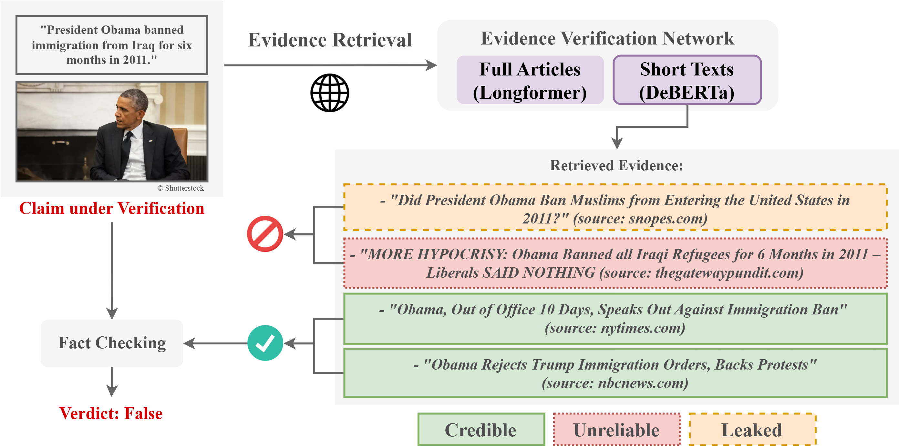

# credule-dataset
Official repository for the "Credible, Unreliable or Leaked?: Evidence verification for enhanced automated fact-checking" paper which was published at the [MAD '24: Proceedings of the 3rd ACM International Workshop on Multimedia AI against Disinformation](https://dl.acm.org/doi/abs/10.1145/3643491.3660278). 

## Abstract
>*Automated fact-checking (AFC) is garnering increasing attention by researchers aiming to help fact-checkers combat the increasing spread of misinformation online. While many existing AFC methods incorporate external information from the Web to help examine the veracity of claims, they often overlook the importance of verifying the source and quality of collected “evidence”. One overlooked challenge involves the reliance on “leaked evidence”, information gathered directly from fact-checking websites and used to train AFC systems, resulting in an unrealistic setting for early misinformation detection. Similarly, the inclusion of information from unreliable sources can undermine the effectiveness of AFC systems. To address these challenges, we present a comprehensive approach to evidence verification and filtering. We create the “CREDible, Unreliable or LEaked” (CREDULE) dataset, which consists of 91,632 articles classified as Credible, Unreliable and Fact-checked (Leaked). Additionally, we introduce the EVidence VERification Network (EVVER-Net), trained on CREDULE to detect leaked and unreliable evidence in both short and long texts. EVVER-Net can be used to filter evidence collected from the Web, thus enhancing the robustness of end-to-end AFC systems. We experiment with various language models and show that EVVER-Net can demonstrate impressive performance of up to 91.5% and 94.4% accuracy, while leveraging domain credibility scores along with short or long texts, respectively. Finally, we assess the evidence provided by widely-used fact-checking datasets including LIAR-PLUS, MOCHEG, FACTIFY, NewsCLIPpings+ and VERITE, some of which exhibit concerning rates of leaked and unreliable evidence.*



If you find our work useful, please cite:
```
@inproceedings{chrysidis2024credible,
  title={Credible, Unreliable or Leaked?: Evidence verification for enhanced automated fact-checking},
  author={Chrysidis, Zacharias and Papadopoulos, Stefanos-Iordanis and Papadopoulos, Symeon and Petrantonakis, Panagiotis},
  booktitle={Proceedings of the 3rd ACM International Workshop on Multimedia AI against Disinformation},
  pages={73--81},
  year={2024}
}
```

## CREDULE Dataset

Download and unzip `data.zip`, ensuring the structure `data/CREDULE.csv` is maintained.
The CREDULE.csv comprises 91,644 samples and 18 columns. A sample can be seen below: 
```python
{'id': 4,
 'article_title': 'Yes, pay for CEOs has far outpaced compensation for average workers',
 'domain': 'www.politifact.com',
 'date': '2021-06-02 00:00:00',
 'topic': 'BUSINESS',
 'topic_grouped': 'Business & Money',
 'article_url': 'https://www.politifact.com/factchecks/2021/jun/02/mandela-barnes/yes-pay-ceos-has-far-outpaced-compensation-average/',
 'MBFC_title': 'Politifact – Bias and Credibility',
 'MBFC_bias_rating': 'LEFT-CENTER',
 'MBFC_factual_reporting': 'HIGH',
 'MBFC_credibility_rating': 'HIGH CREDIBILITY',
 'MBFC_url': 'https://mediabiasfactcheck.com/politifact/',
 'MBFC_domain_score': 3,
 'label_encoded': 0,
 'label': 'fact_checked',
 'split': 'TRAIN',
 'source_data_id': '10.0',
 'source_dataset': 'Politifact_Kaggle'}
```

The ```article_title``` column can be used to reproduce the "short text" experiments of the paper. 
The ```split``` column specifies the train/validation/test divisions used in the paper, allowing for easy retrieval of each dataset split, for example:
```python
import pandas as pd
df = pd.read_csv("data/CREDULE.csv", index_col=0)
train_df = df[df.split == "TRAIN"]
valid_df = df[df.split == "VALIDATION"]
test_df = df[df.split == "TEST"]
```

To access full article texts and reproduce the "long text" experiments, use the ```article_url``` column.  Note that approximately 40% of samples lack URLs. For these cases, download the following datasets and merge them with the CREDULE dataset using the ```source_dataset``` and ```source_data_id``` columns. Note: For the Politifact dataset, use incrementing IDs; for NELA-GT, match based on article title.
- MULTIFC -> https://www.copenlu.com/publication/2019_emnlp_augenstein/
- Politifact -> https://www.kaggle.com/datasets/rmisra/politifact-fact-check-dataset
- PUBHEALTH -> https://github.com/neemakot/Health-Fact-Checking
- FakeNewsCorpus -> https://github.com/several27/FakeNewsCorpus
- NELA-GT -> https://github.com/MELALab/nela-gt

If you have trouble retrieving the full article texts, please contant: Stefanos-Iordanis Papadopoulos (stefpapad@iti.gr) 

## Licence
This project is licensed under the Apache License 2.0 - see the [LICENSE](https://github.com/mever-team/credule-dataset/blob/main/LICENSE) file for more details.

## Acknowledgements
This work is partially funded by the project "vera.ai: VERification Assisted by Artificial Intelligence" under grant agreement no. 101070093 and DisAI under grant agreement no. 101079164.
